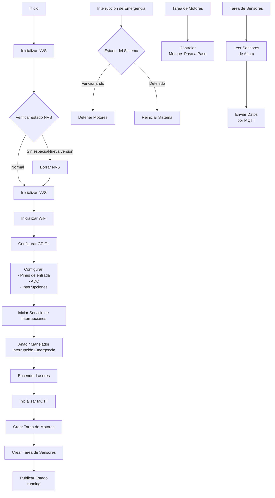

# Diagrama de FLUJO

```mermaid
flowchart TD
    A[Inicio] --> B[Inicializar NVS]
    
    B --> C{Verificar estado NVS}
    C -->|Sin espacio/Nueva versión| D[Borrar NVS]
    C -->|Normal| E[Continuar]
    
    D --> E[Inicializar NVS]
    
    E --> F[Inicializar WiFi]
    F --> G[Configurar GPIOs]
    
    G --> H[Configurar:
    - Pines de entrada
    - ADC
    - Interrupciones]
    
    H --> I[Iniciar Servicio de Interrupciones]
    I --> J[Añadir Manejador\nInterrupción Emergencia]
    
    J --> K[Encender Láseres]
    K --> L[Inicializar MQTT]
    
    L --> M[Crear Tarea de Motores]
    M --> N[Crear Tarea de Sensores]
    
    N --> O[Publicar Estado\n'running']
    
    %% Subproceso de Interrupción de Emergencia
    P[Interrupción de Emergencia] --> Q{Estado del Sistema}
    Q -->|Funcionando| R[Detener Motores]
    Q -->|Detenido| S[Reiniciar Sistema]
    
    %% Subproceso de Tareas
    T[Tarea de Motores] --> U[Controlar\nMotores Paso a Paso]
    V[Tarea de Sensores] --> W[Leer Sensores\nde Altura]
    W --> X[Enviar Datos\npor MQTT]
```
