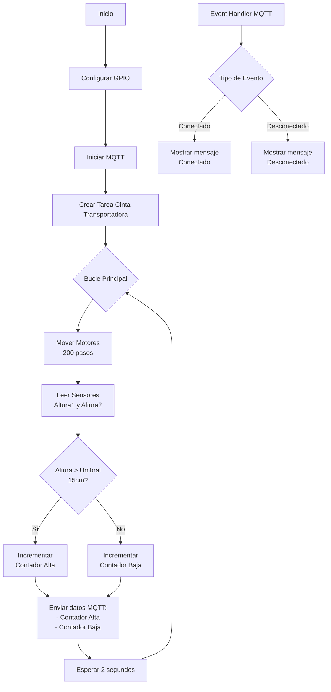

# Diagrama de FLUJO

```mermaid
flowchart TD
    A[Inicio] --> B[Configurar GPIO]
    B --> C[Iniciar MQTT]
    C --> D[Crear Tarea Cinta Transportadora]
    D --> E{Bucle Principal}
    
    E --> F[Mover Motores\n200 pasos]
    F --> G[Leer Sensores\nAltura1 y Altura2]
    
    G --> H{Altura > Umbral\n15cm?}
    H -->|Sí| I[Incrementar\nContador Alta]
    H -->|No| J[Incrementar\nContador Baja]
    
    I --> K[Enviar datos MQTT:\n- Contador Alta\n- Contador Baja]
    J --> K
    
    K --> L[Esperar 2 segundos]
    L --> E
    
    %% Subproceso MQTT
    M[Event Handler MQTT] --> N{Tipo de Evento}
    N -->|Conectado| O[Mostrar mensaje\nConectado]
    N -->|Desconectado| P[Mostrar mensaje\nDesconectado]
```
